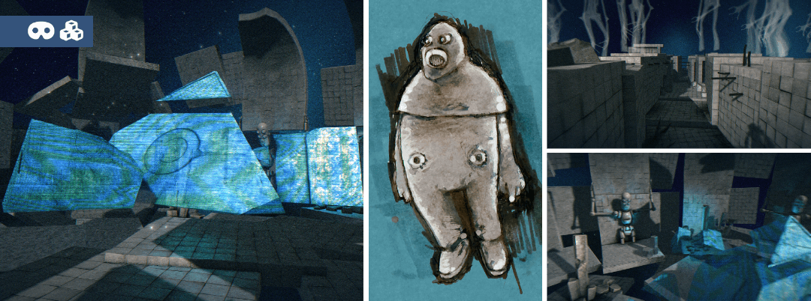

# Within the mesh (of Eryx)

A PC Demo released at the Evoke 2013 demoparty in Koeln, Germany

_Within the Mesh_ is demoscene production inspired by a [Lovecraft & Sterling short story](https://en.wikipedia.org/wiki/In_the_Walls_of_Eryx) and [an iconic demoscene production](https://www.pouet.net/prod.php?which=31088), using some of their "open" 3D files. Winner of the 2nd place at the Evoke 2013, in the "PC Demos" competition. Here I have tried to communicate the emotions suggested by the reading of the novel through a subjective sequence shot. Produced with the help of [Jean-Marie Lamarche-Deminal](https://www.artstation.com/kaanlee), 3D artist and [Mathieu `Alkama` Moncharmont](https://soundcloud.com/alkama), musician.
## What does the source look like ?

### Squirrel scripts

The main demo structure is written in Squirrel, an interpreted language (similar to LUA), running inside the GameStart engine.

Even though the demo uses a custom version of the engine, it should run without too many changes with the public alpha release of GameStart.

The main loop of the demo is handled by the SceneManager class, that invokes several object updates. The whole demo is driven by a single clock, normalized between 0 and 1.

Most of the 3D objects displayed by the demo are controlled by single scripts whose OnUpdate() callback is called automatically by the engine.
Each of these controllers exclusively relies on the distance to the main camera. Thus, the viewer of the demo can seek forward or backward.

### Shaders

The visual aspect of the demo relies on shaders, written in ustom and platform agnostic shading language that it very close to the GLSL.

**Tree of the classes calls**

<pre>
project.nut
	|
	+-preloader.nut
	|
	+-scene_manager.nut
		|
		+-intro_handler.nut
		|	|
		|	+-title_handler.nut
		|	+-subtitles_handler.nut
		|
		+-camera_ride.nut
		|
		+-holographic_camera.nut
		|
		+-utils/block_activator.nut
</pre>

## Description of the classes

- *base_animator.nut*
  - Base class to handle the distance of an item to the camera and evaluate the subsequent animation coefficient.
- *base_scene.nut*
- *camera_ride.nut*
  - Core of the ride scene. Collects the keyframes items, creates a smooth path and moves the camera along this path.
- *crystal_animator.nut*
  - Animation routine of the crystal items.
- *floating_wall_animator.nut*
  - Animation routine of the floating wall items.
- *fog_animator.nut*
  - Controls the fog along the time.
- *gate_iris_animator.nut*
  - Open the iris gate according to its distance to the camera.
- *holographic_camera.nut*
  - Handle the "render to texture" routine and provided the framebuffers to the shader that displays the "holographic" items of the demo.
- *intro_handler.nut*
  - Handles the timings of the introduction.
- *laser_writer.nut*
  - Routine that draws 3D texts on the screen. Initialy create for the "greets" part, ultimately rejected for performance reasons.
- *light_animator.nut*
- *logo_handler.nut*
  - Handle the display of the whole logo sequence, the light and the sound.
- *machine_animator.nut*
- *mesh_cycler.nut*
  - Loads a series of (50) meshes, and replays them as an animated sequence.
- *music.nut*
- *neon_writer.nut*
  - Routine that draws 3D texts on the screen. Replaced the laser routine for performance sake.
- *plant_animator.nut*
  - Recursively grows a plant according to the distance to the camera.
- *preloader.nut*
  - Preload the main assets.
- *project.nut*
  - Main project routine. Basically, loads the main scene.
- *scene_manager.nut*
  - Main scene that drives the demo. Load the assets & scenegraph of the logo screen and the introduction screen and add them into the main scenegraph.
  - Switch from a screen to another, according the the main clock of the demo, and enable/disable the parts of the scenegraph that are not relevant to the current screen.
  - Use a dispatch variable to handle the different updates required by each part of the demo.
- *subtitles_handler.nut*
  - Handles the timing & displays the subtitles of the demo.
- *synchro-track_beeps.nut*
  - Timecode track extracted from the main music, used to sync an FX with the music.
- *temple_animator.nut*
- *temple_hat_animator.nut*
- *title_handler.nut*
  - Handled the title items (2D sprites, 3D billboards) of the intro screen.
- *ui.nut*
- *ui_demo.nut*

### Directory of within-the-mesh-demoscene-project\gs_project\scripts\utils

- *block_activator.nut*
  - Distance culling on the static items of the main scene. Evaluated at low frequency.
- *item_play_motion.nut*
  - Unused.
- *utils.nut*
  - Misc utility functions and classes.
